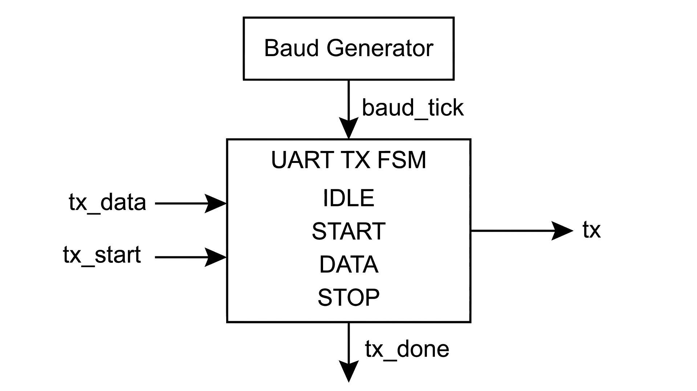
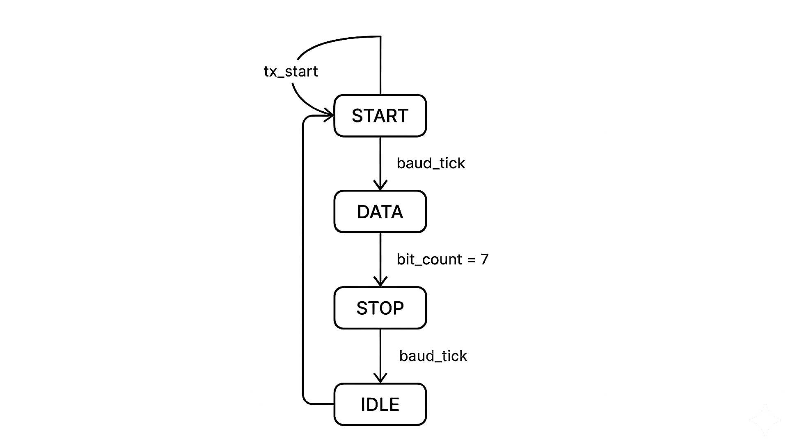
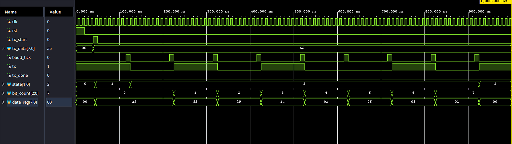

# UART Transmitter using Verilog HDL


## Overview

This project implements a UART (Universal Asynchronous Receiver Transmitter) using Verilog HDL. The design converts 8-bit parallel data into a serial data stream through an FSM-based architecture and configurable baud-rate generation. The transmitter follows the standard UART protocol consisting of Start, Data, and Stop bits.

The project was designed, simulated, and verified using Xilinx Vivado and is targeted for implementation on the Basys-3 FPGA development board.

---

## Features

* FSM-Based UART Transmitter
* Configurable Baud Rate Generation
* 8-Bit Data Transmission
* Start and Stop Bit Support
* LSB-First Serial Transmission
* Vivado Simulation Verified
* Basys-3 FPGA Compatible
* GitHub Actions Continuous Integration

---

## Architecture

<p align="center">
  
</p>

### System Components

#### Baud Generator

* Generates baud_tick pulses from the system clock.
* Controls UART transmission timing.

#### UART Transmitter FSM

Implements four states:

* IDLE
* START
* DATA
* STOP

The FSM serializes parallel data and transmits it according to the UART protocol.

---

## FSM State Diagram

<p align="center">
  
</p>

### State Description

| State | Function                       |
| ----- | ------------------------------ |
| IDLE  | Waits for transmission request |
| START | Sends UART Start Bit (0)       |
| DATA  | Transmits 8-bit data serially  |
| STOP  | Sends UART Stop Bit (1)        |

---

## Simulation Results

### UART Transmission Waveform

<p align="center">
  
</p>

### Verification

Transmitted Data:

```text
8'hA5
```

Binary Representation:

```text
10100101
```

UART transmits data LSB first:

```text
1 → 0 → 1 → 0 → 0 → 1 → 0 → 1
```

Observed waveform confirms:

* Correct baud timing
* Proper FSM state transitions
* Successful serial data transmission
* Correct stop-bit generation

---

## Repository Structure

```text
uart-transmitter-verilog/
│
├── rtl/
│   ├── baud_generator.v
│   └── uart_tx.v
│   └── uart_tx_top.v
├── tb/
│   └── uart_tx_tb.v
│
├── constraints/
│   └── uart_tx_basys3.xdc
│
├── docs/
│   ├── uart_architecture.png
│   └── uart_fsm.png
│
├── screenshots/
│   └── uart_tx_waveform.png
│
├── .github/
│   └── workflows/
│       └── verilog-ci.yml
│
└── README.md
```

---

## Tools Used

* Verilog HDL
* Xilinx Vivado
* Basys-3 FPGA Board
* Git & GitHub
* GitHub Actions

---

## Applications

* FPGA-Based Communication Systems
* Embedded Systems
* Serial Data Communication
* Digital System Interfacing
* UART-Based Debugging and Monitoring
* FPGA and RTL Design Learning

---

## Authors

### Lakshmi Omkareswar Thummagunta

* UART Architecture Design
* Baud Generator Development
* FSM-Based UART Transmitter Implementation
* RTL Simulation and Verification
* FPGA Integration and Testing

### Sriya Adimulam

* Project Documentation
* FSM and Architecture Diagram Preparation
* Waveform Analysis
* Repository Organization
* Technical Presentation Support

---

## Future Enhancements

* UART Receiver Implementation
* Full UART TX/RX Communication System
* Parity Bit Support
* Configurable Data Width
* Configurable Stop Bits
* FPGA Hardware Demonstration
* Integration with Microcontrollers and Sensors

---